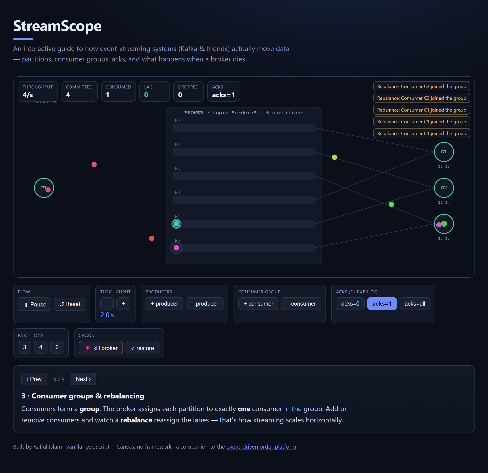

# StreamScope

An interactive, animated explainer for how event-streaming systems (Kafka and
friends) actually move data — **partitions, consumer groups, acks, lag, and
broker failure** — rendered live on an HTML canvas with zero runtime
dependencies.

It's a teaching toy and a portfolio piece: a companion to my
[event-driven order platform](https://github.com/rafeeban4/order-platform),
turning the same distributed-systems concepts into something you can *poke*.



**Live:** https://streamscope-demo.web.app · regenerate the screenshot with
`node scripts/shot.mjs` while `npm run dev` is running.

## What it shows

Producers emit keyed events → the broker appends them to a **partitioned log** →
a **consumer group** reads them. The simulation is deliberately simplified but
behaviourally honest about the tradeoffs:

- **Partitioning by key** — a stable hash sends every event for a key to the
  same partition, so per-key **ordering** is preserved. The engine enforces
  this: only the lowest-offset in-log message in a partition is eligible to be
  consumed.
- **Consumer groups & rebalancing** — each partition is owned by exactly one
  consumer. Add/remove consumers and watch partitions get reassigned (animated
  dashed wires).
- **acks (durability dial)** — `acks=0/1/all` change the replication ring and,
  crucially, what happens on failure.
- **Lag** — un-consumed committed messages, surfaced as the headline health
  metric.
- **Broker failure** — kill the broker mid-stream; weak acks visibly **drop**
  messages (red ✕), strong acks don't. Restore and the stream heals.

A 6-chapter guided tour walks through each concept and configures the scene for
you; all manual controls stay live.

## Tech

Vanilla **TypeScript + Canvas 2D**, built with **Vite**. No React, no charting
library. The whole thing gzips to ~6 kB of JS.

- `src/engine.ts` — the simulation model (no rendering, no DOM).
- `src/render.ts` — pure draw layer; state in, pixels out.
- `src/main.ts` — the loop, controls, HUD, and guided chapters.

## Run

```bash
npm install
npm run dev      # http://localhost:5185
npm run build    # static bundle in dist/, deploy anywhere
```

## Notes on fidelity

This models the *concepts*, not the wire protocol. Replication, ISR, offset
commits, and retries are abstracted into visual analogues. Where the real
default is "data loss on failure with weak acks and no retry," the sim shows
exactly that — the point is to make the tradeoffs legible, not to hide them.
